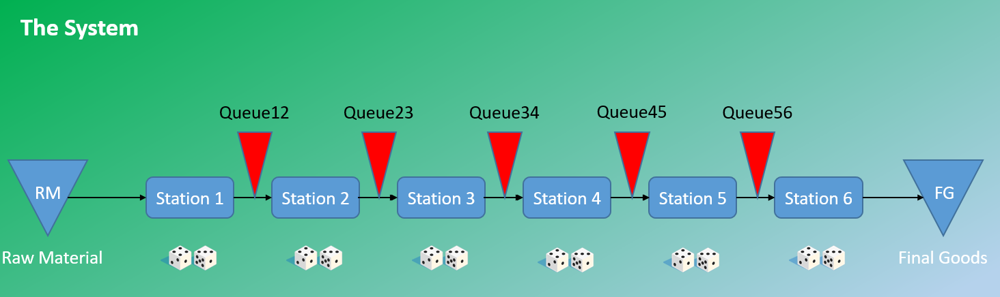

# DiceGame
Goldratt's "Dice  Game" and the Five Focusing Steps - A simulation for learning purposes

This repository contains "Dice Game" files. The Dice Game was introduced in one of the best-selling business books of all time, THE GOAL, authored by Dr. Eli Goldratt.  

Compared to other simulations and simulation tools, this notebook is slightly different because we simulate five different scenarios to highlight the interdependencies within the line. 

The scenario sequence is as follows:  
1. Balanced Line  
2. Constrained Line  
3. TOC - DBR with a focus on the Rope  
4. TLS  
5. Full TOC  

While running through the different scenarios we consider the *Five Focusing Steps* of the TOC - Theory of Constraints as well.

- DiceGame.nb (Mathematica notebook)
- DiceGame.cdf (for older versions of the free Wolfram Player)
- DiceGame.pdf (the notebook in PDF format)
